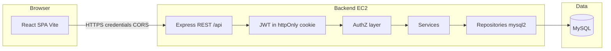

# Architecture

## System context



phpMyAdmin is used only for human administration of MySQL, not at runtime.

---

## Backend layers

| Layer | Responsibility |
|-------|----------------|
| `routes` | HTTP method, path, middleware chain |
| `validators` | Zod schemas; map to `req.validated` |
| `controllers` | Parse request, call service, map to HTTP response |
| `services` | Business rules, RBAC per resource, transactions |
| `repositories` | Parameterized SQL only |
| `middleware` | `authenticate`, `authorize`, `validate`, rate limit, errors |
| `utils` | JWT, cookies, ApiError, pagination helpers |

**Rule:** Controllers stay thin; every task/user mutation checks role + scope in the service layer.

---

## Frontend layers

| Area | Responsibility |
|------|----------------|
| `services/api.js` | Axios instance, `baseURL`, `withCredentials: true` |
| `context/AuthContext` | `user`, `loading`, `login`, `logout`, `refreshMe` |
| `routes` | Public vs protected; `ProtectedRoute`, `RoleGuard` |
| `pages` | Route-level screens |
| `components` | Reusable UI (table, badges, modals) |
| `validators` | Zod schemas mirrored with forms |

Route guards improve UX; **backend always re-validates**.

---

## Folder structure (target)

```
task_management_kartikey/
├── backend/
│   ├── database/              # symlink or copy — root database/ is canonical
│   ├── src/
│   │   ├── config/            # db, env, cookie, cors
│   │   ├── controllers/
│   │   ├── services/
│   │   ├── repositories/
│   │   ├── routes/
│   │   ├── middleware/
│   │   ├── validators/
│   │   ├── utils/
│   │   ├── app.js
│   │   └── server.js
│   ├── .env.example
│   └── package.json
├── frontend/
│   ├── src/
│   │   ├── components/
│   │   ├── pages/
│   │   ├── layouts/
│   │   ├── routes/
│   │   ├── context/
│   │   ├── hooks/
│   │   ├── services/
│   │   ├── utils/
│   │   ├── validators/
│   │   ├── App.jsx
│   │   └── main.jsx
│   └── package.json
├── database/
│   ├── schema.sql
│   └── seed.sql                 # Phase 2
└── docs/
```

---

## Authentication flow

1. `POST /api/auth/login` — validate body, check `is_active`, verify bcrypt, issue JWT, set `httpOnly` cookie (`token`).
2. Subsequent requests — `authenticate` reads cookie, verifies JWT, attaches `req.user` `{ id, email, role }` (no password hash).
3. `POST /api/auth/logout` — clear cookie.
4. `GET /api/auth/me` — return safe user profile from DB (role from DB, not JWT claim alone for sensitive ops we re-fetch role on mutation).

**JWT payload (minimal):** `sub` (user id), `iat`, `exp`. Role loaded from DB on each authorized request to prevent stale role in token after admin changes role.

---

## CSRF (cookie-based SPA)

- `SameSite=Lax` or `Strict` in dev; `Secure` + `SameSite=None` in production HTTPS.
- Mutating requests (`POST`, `PUT`, `PATCH`, `DELETE`): require header `X-CSRF-Token` matching non-httpOnly cookie `csrf_token` set at login (double-submit), or use SameSite Strict + custom header `X-Requested-With: XMLHttpRequest` as secondary signal.
- Document final choice in README during Phase 2 implementation.

---

## API response envelope

**Success (single resource):**

```json
{ "success": true, "data": { ... } }
```

**Success (list + pagination):**

```json
{
  "success": true,
  "data": [ ... ],
  "meta": { "page": 1, "limit": 10, "total": 42, "totalPages": 5 }
}
```

**Error:**

```json
{
  "success": false,
  "error": { "code": "FORBIDDEN", "message": "You do not have permission to perform this action." }
}
```

Validation errors include `details` array (Zod field paths).

---

## Security checklist (implementation phases)

- bcrypt cost factor 10–12
- No secrets in repo; `.env` gitignored
- Helmet, rate limit on `/api/auth/login`
- Parameterized queries only
- Admin-only user role assignment; strip `role` from non-admin update payloads
- Inactive users cannot login
- Activity logs for admin-auditable actions (Phase 3)

---

## Deployment topology (target)

| Tier | Host | Notes |
|------|------|--------|
| Frontend | Vercel | `VITE_API_URL` → backend HTTPS |
| Backend | AWS EC2 | Node behind nginx, TLS termination |
| MySQL | Managed RDS or equivalent | Private network to EC2 |

Health: `GET /api/health` → `{ "status": "ok", "db": "connected" }`.
